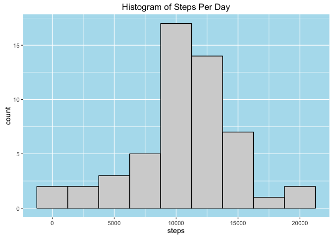
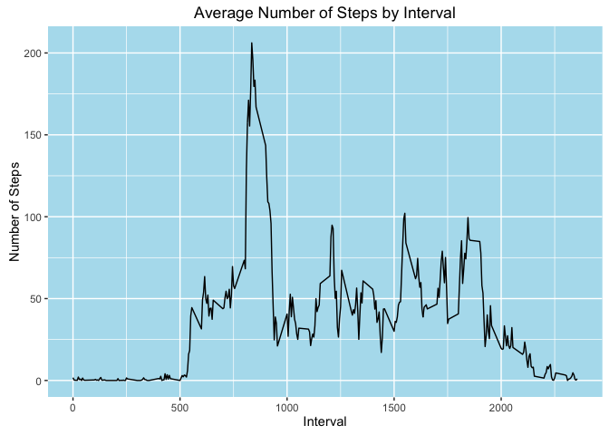
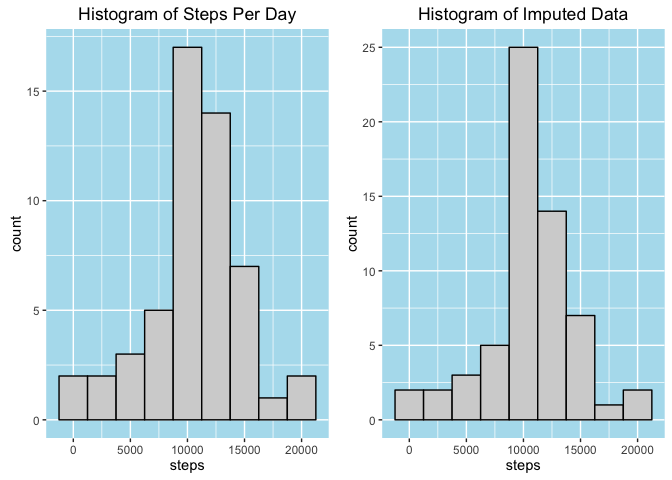
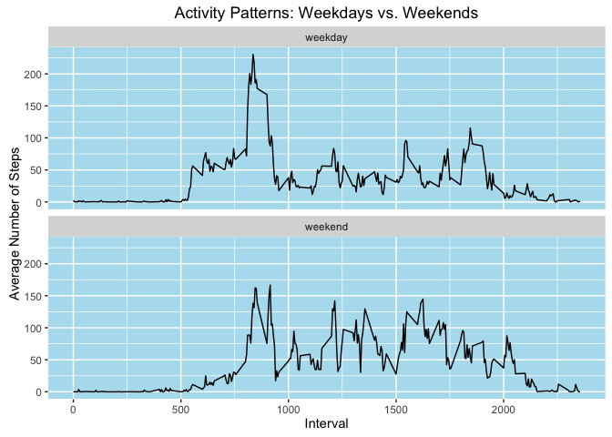

### Loading and preprocessing the data

1.  *Load the data (i.e. read.csv())*.

<!-- -->

    activity <- read.csv("activity.csv")
    summary(activity)

    ##      steps                date          interval     
    ##  Min.   :  0.00   2012-10-01:  288   Min.   :   0.0  
    ##  1st Qu.:  0.00   2012-10-02:  288   1st Qu.: 588.8  
    ##  Median :  0.00   2012-10-03:  288   Median :1177.5  
    ##  Mean   : 37.38   2012-10-04:  288   Mean   :1177.5  
    ##  3rd Qu.: 12.00   2012-10-05:  288   3rd Qu.:1766.2  
    ##  Max.   :806.00   2012-10-06:  288   Max.   :2355.0  
    ##  NA's   :2304     (Other)   :15840

1.  *Process/transform the data (if necessary) into a format suitable
    for your analysis.*  
    The dataset appears to be tidy (long, narrow form) and there do not
    appear to be any outliers to address; however, I did choose to
    convert the date field to type Date.

<!-- -->

    activity$date <- as.Date(activity$date)

### What is the mean total number of steps taken per day?

1.  *Calculate the total number of steps taken per day.*

<!-- -->

    aggrSum <- aggregate(steps ~ date, data=activity, FUN=sum)
    head(aggrSum)

    ##         date steps
    ## 1 2012-10-02   126
    ## 2 2012-10-03 11352
    ## 3 2012-10-04 12116
    ## 4 2012-10-05 13294
    ## 5 2012-10-06 15420
    ## 6 2012-10-07 11015

1.  *Make a histogram of the total number of steps taken each day.*

<!-- -->

    hist1 <- qplot(steps, data=aggrSum, binwidth=2500, fill=I("lightgrey"), 
                   col=I("black"), main="Histogram of Steps Per Day") +
                   theme(panel.background=element_rect(fill="lightblue2"))
    print(hist1)

1.  Calculate and report the mean and median of the total number of
    steps taken per day. **Note: the numbers produced by the summary()
    function are different if the default digits option is used due
    to rounding. The summary() output could be corrected
    using options(digits=10).**

<!-- -->

    mean(aggrSum$steps)

    ## [1] 10766.19

    median(aggrSum$steps)

    ## [1] 10765

### What is the average daily activity pattern?

1.  *Make a time series plot (i.e. type = "l") of the 5-minute
    interval (x-axis) and the average number of steps taken, averaged
    across all days (y-axis).*

<!-- -->

    aggrMean <- aggregate(steps ~ interval, data=activity, FUN=mean)
    qplot(interval, steps, data=aggrMean, geom="line", xlab="Interval", 
          ylab="Number of Steps", main="Average Number of Steps by Interval") +
          theme(panel.background=element_rect(fill="lightblue2"))

1.  *Which 5-minute interval, on average across all the days in the
    dataset, contains the maximum number of steps?*

<!-- -->

    aggrMean$interval[which.max(aggrMean$steps)]

    ## [1] 835

### Imputing missing values

Note that there are a number of days/intervals (in the original data)
where there are missing values (coded as NA). The presence of missing
days may introduce bias into some calculations or summaries of the data.

1.  *Calculate and report the total number of missing values in the
    dataset (i.e., the total number of rows with NAs).*

<!-- -->

    colSums(is.na(activity))

    ##    steps     date interval 
    ##     2304        0        0

1.  *Devise a strategy for filling in all of the missing values in
    the dataset. The strategy does not need to be sophisticated. For
    example, you could use the mean/median for that day, or the mean for
    that 5-minute interval, etc.*

The strategy I have chosen is to replace the NAs with the mean for the
interval.

1.  *Create a new dataset that is equal to the original dataset but with
    the missing data filled in.*

<!-- -->

    activityUpdate <- activity
    activityUpdate$steps <- ifelse(is.na(activityUpdate$steps), 
            aggrMean$steps[match(aggrMean$interval, activityUpdate$interval)], 
            activityUpdate$steps)

1.  *Make a histogram of the total number of steps taken each day and
    calculate and report the mean and median total number of steps taken
    per day. Do these values differ from the estimates from the first
    part of the assignment? What is the impact of imputing missing data
    on the estimates of the total daily number of steps?*

Imputing the data using the means for the various intervals increases
the number of days in the mean range. With NAs, there appear to be 19
days in the mean range, while the imputed data has 25. The counts for
the other ranges remain the same. The mean and median are essentially
unchanged as well.

    aggrSum2 <- aggregate(steps ~ date, data=activityUpdate, FUN=sum)
    hist2 <- qplot(steps, data=aggrSum2, binwidth=2500, fill=I("lightgrey"),
                   col=I("black"), main="Histogram of Imputed Data") +
                   theme(panel.background=element_rect(fill="lightblue2"))
    grid.arrange(hist1, hist2, ncol=2)

    mean(aggrSum2$steps)

    ## [1] 10766.19

    median(aggrSum2$steps)

    ## [1] 10766.19

### Are there differences in activity patterns between weekdays and weekends?

1.  *Create a new factor variable in the dataset with two levels -
    "weekday" and "weekend" indicating whether a given date is a weekday
    or weekend day.*

<!-- -->

    activityUpdate$weekday <- factor(ifelse(wday(activityUpdate$date) %in% c(2:6), 
            "weekday", "weekend"))
    table(activityUpdate$weekday)

    ## 
    ## weekday weekend 
    ##   12960    4608

1.  \*Make a panel plot containing a time series plot (i.e., type="l")
    of the 5-minute interval (x-axis) and the average number of steps
    taken, averaged across all weekday days or weekend days (y-axis).

<!-- -->

    aggrMean2 <- aggregate(steps ~ interval + weekday, 
                           data=activityUpdate, FUN=mean)
    ggplot(aggrMean2, aes(x=interval, y=steps)) + xlab("Interval") + 
        ylab("Average Number of Steps") + geom_line() + 
        theme(panel.background=element_rect(fill="lightblue2")) +
        facet_wrap(~weekday, nrow=2) + 
        ggtitle("Activity Patterns: Weekdays vs. Weekends")

